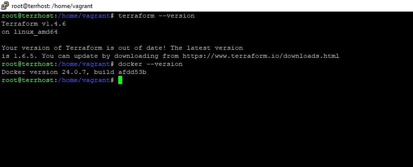
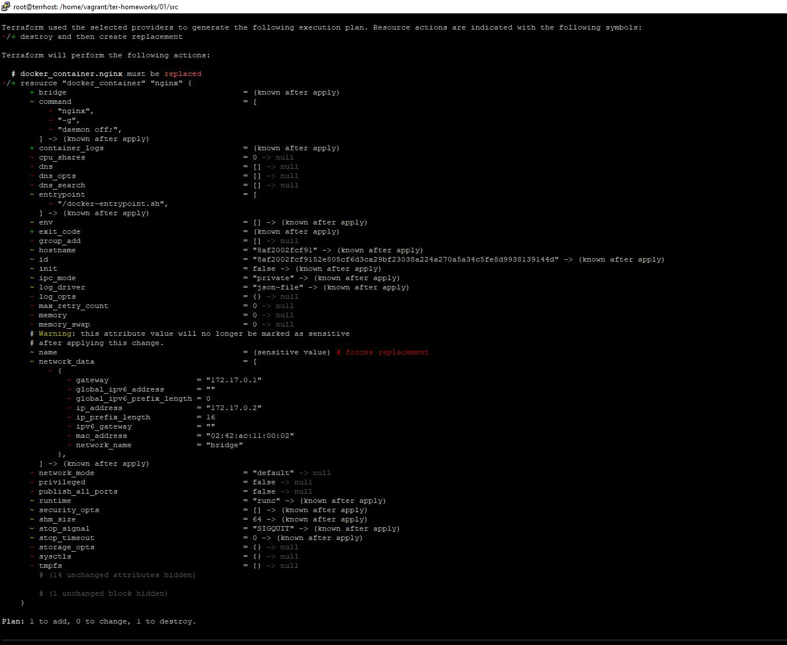
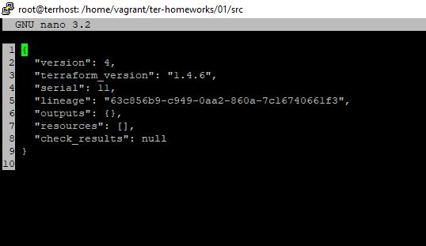

# Домашнее задание к занятию «Введение в Terraform», Лебедев А.И., fops-10

### Цели задания

1. Установить и настроить Terrafrom.
2. Научиться использовать готовый код.

------

### Чек-лист готовности к домашнему заданию

1. Скачайте и установите **Terraform** версии =1.5.Х (версия 1.6 может вызывать проблемы с Яндекс провайдером) . Приложите скриншот вывода команды ```terraform --version```.
2. Скачайте на свой ПК этот git-репозиторий. Исходный код для выполнения задания расположен в директории **01/src**.
3. Убедитесь, что в вашей ОС установлен docker.
4. Зарегистрируйте аккаунт на сайте https://hub.docker.com/, выполните команду docker login и введите логин, пароль.

### Чек лист:  

- Т.к. на моей виртуальной машине уже был установлен terraform (версия 1.4.*), я оставил его же и доустановил docker, также, я склонировал весь репозиторий терраформ-модуля и залогинился на dockerhub с этой машины:

  


------


### Задание 1

1. Перейдите в каталог [**src**](https://github.com/netology-code/ter-homeworks/tree/main/01/src). Скачайте все необходимые зависимости, использованные в проекте. 
2. Изучите файл **.gitignore**. В каком terraform-файле, согласно этому .gitignore, допустимо сохранить личную, секретную информацию?
3. Выполните код проекта. Найдите  в state-файле секретное содержимое созданного ресурса **random_password**, пришлите в качестве ответа конкретный ключ и его значение.
4. Раскомментируйте блок кода, примерно расположенный на строчках 29–42 файла **main.tf**.
Выполните команду ```terraform validate```. Объясните, в чём заключаются намеренно допущенные ошибки. Исправьте их.
5. Выполните код. В качестве ответа приложите: исправленный фрагмент кода и вывод команды ```docker ps```.
6. Замените имя docker-контейнера в блоке кода на ```hello_world```. Не перепутайте имя контейнера и имя образа. Мы всё ещё продолжаем использовать name = "nginx:latest". Выполните команду ```terraform apply -auto-approve```.
Объясните своими словами, в чём может быть опасность применения ключа  ```-auto-approve```. Догадайтесь или нагуглите зачем может пригодиться данный ключ? В качестве ответа дополнительно приложите вывод команды ```docker ps```.
8. Уничтожьте созданные ресурсы с помощью **terraform**. Убедитесь, что все ресурсы удалены. Приложите содержимое файла **terraform.tfstate**. 
9. Объясните, почему при этом не был удалён docker-образ **nginx:latest**. Ответ **обязательно** подкрепите строчкой из документации [**terraform провайдера docker**](https://docs.comcloud.xyz/providers/kreuzwerker/docker/latest/docs).  (ищите в классификаторе resource docker_image )

### Выполнение:  

- Перейдем в /src и скачаем зависимости:

  

- В данном .gitignore-файле нужно сохранять личную информацию:

```
# own secret vars store.
personal.auto.tfvars
```

- Выполним код проекта и посмотрим в state-файл, ключ будет в строчке **"result":**, поставил курсор на скриншоте:

  

  

- После выполнения команды **terraform validate** мы видим несколько ошибок. Первая указывает на то, что в определении ресурса **"docker_image"** был пропущен блок названия данного ресурса, вторая - что название ресурса может начинаться только с буквы или нижнего подчеркивания (так я перевел). Также, код содержал некоторые другие ошибки, включая не правильное название переменной, которую мы приписываем к имени создаваемого контейнера (исправленный **main.tf** файл вы можете посмотреть в **/src** данного репозитория, правда, я его закоммитил, когда уже изменил название контейнера на hello_world):

     

 

- Опасность ключа **-auto-approve** может заключаться в том, что не внимательный инженер, может не уловить главную вещь...уж не знаю как, ибо все там на плане аж сверкает краснотой:

   

- ...главную вещь, т.е. то, что предыдущий инстанс будет удален и на его место будет установлен новый, измененный:

  

- Содержимое state-файла после команды **terraform destroy**:



-  Образ **nginx:latest** сохранился после удаления контейнера по той причине, что у нас (в отличие от кода по ссылке) присутствует ледующая строчка:

```
resource "docker_image" {
  name         = "nginx:latest"
  keep_locally = true
}
```

- Именно наличие строчки **keep_locally = true** оставляет образ в локальном репозитории не тронутым


------

## Дополнительное задание (со звёздочкой*)

**Настоятельно рекомендуем выполнять все задания со звёздочкой.** Они помогут глубже разобраться в материале.   
Задания со звёздочкой дополнительные, не обязательные к выполнению и никак не повлияют на получение вами зачёта по этому домашнему заданию. 

### Задание 2*

1. Изучите в документации provider [**Virtualbox**](https://docs.comcloud.xyz/providers/shekeriev/virtualbox/latest/docs) от 
shekeriev.
2. Создайте с его помощью любую виртуальную машину. Чтобы не использовать VPN, советуем выбрать любой образ с расположением в GitHub из [**списка**](https://www.vagrantbox.es/).

В качестве ответа приложите plan для создаваемого ресурса и скриншот созданного в VB ресурса.   

### Решение:  

- Уважаемые коллеги, я хотел выполнить это задание, но погряз в ряде трудностей. Я работаю на windows-машине, на ней у меня есть VBox и линукс-машины я разворачиваю Вагрантом в VBox. Я подумал, что т.к. и терраформ и вагрант - это оба продукта от хашикорп, то можно их совместить при выполнении разворота машины. Но, тут либо мне нужно было городить виртуалку на линуксе с виртуалбоксом, что есть вложенная виртуализация и это будет кошмар, либо ставить терраформ на windows, чего мне тоже делать не хочется. В общем, я погуглил и, собрал вот такой пример кода, который, верятно (но совсем не точно), сработает, если на машине есть все необходимые нструменты:

```
terraform {
  required_providers {
    vagrant = {
      source = "cn-terraform/vagrant"
    }
    virtualbox = {
      source = "hashicorp/virtualbox"
    }
  }
}

provider "vagrant" {
  version = ">= 0.3"
}

provider "virtualbox" {
  version = ">= 2.0"
}

resource "vagrant_box" "example_box" {
  provider = vagrant
  name     = "bento/ubuntu-20.04" 
}

resource "virtualbox_vm" "example_vm" {
  provider = virtualbox

  name   = "my_ghost_machine"
  memory = 2048
  cpus   = 1

  source = vagrant_box.example_box.name

  network_adapter {
    type   = "bridged"
    bridge = "eth0"  
  }
}
```

------
